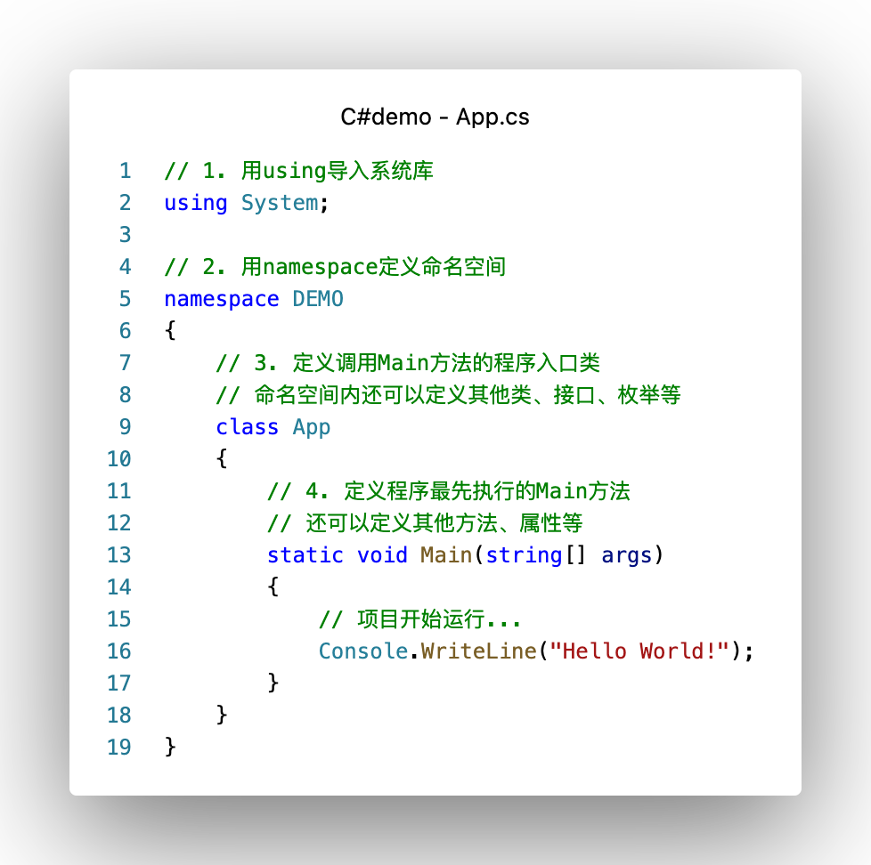

# 面向WEB应用程序后端开发的C#语法简介

## 0.创建demo项目、C#程序结构和规范

- demo项目创建方法参考./Documents/任务过程/C组/dotNET.md
  - 我的环境：.NET 6.0.301平台 + VSCode编辑 + 终端构建运行，比VS简陋很多，所以只传了源代码到GitHub，导入你自己创建的项目即可（或者只看文档，文档基本有所有代码截图）
  - 如果你也用命令行从零创建：
    - 进到新文件夹下
    - `dotnet new console`创建命令行项目
    - `dotnet run`运行项目

- demo项目（或者说命令行项目）类似python，代码一路下来就可以运行，但C#开发需要用以下程序结构

  

- **重点**：项目开发中必须遵守的规范

  1. 1个文件一个类（接口、枚举），文件名和类同名

  2. 命名规范

     1. 类、方法，单词首字母大写，不加下划线，如`public class DataServive`，`public void GetTotalNum(List<int> array)`

     2. 接口除了以上要求，前面加“I”，如`public interface IRunnable`

     3. 变量、参数驼峰命名法，前缀、下划线、后缀都不需要

  3. 注释
     1. 多写注释，把写注释当成和写代码一样重要的工作
     2. 只用`//`注释，注释单独在一行，不使用`/* */`，不把注释放在代码同一行后面
     3. 每个方法用注释说明输入、输出、功能，每个类说明所处模块、对应的对象是什么、功能，函数中每隔一定行数写一段注释
  4. commit规范
     1. 一般而言，一次pull request包含若干次commit，一天工作结束前创建今天进展的pull request
     2. 每写完一个方法、一个类或一段完整的开发进度，commit一次，只改了几行的无效commit会被close
     3. commit提交信息简短概述这次commit的内容，pull request也有描述功能，写清楚干了什么

项目开发过程中，请严格遵守上面的规范，其一是保证代码可读性好、其他人调用你的代码方便，其二体谅我的review工作。严重违反规范的pull request将被close掉。

## 1.基础语法

假设你已经会的：

- C++面向过程编程的所有基础语法
  - 变量类型、函数、类、条件语句、循环语句、命名空间、异常处理、文件IO等等
- 数据结构与算法
  - 链表、栈、队列、树、图的实现
  - 在上面数据结构之上实现的各种算法

- 面向对象编程基础
  - 封装、继承、多态的概念
  - 类的层次结构实现

基础语法与C++基本一样，发现有不一样的、想用C#高级一点语法（比如foreach代替for(int i...)）的，参考：

- 菜鸟教程 https://www.runoob.com/csharp/csharp-tutorial.html
- Microsoft官方文档 https://learn.microsoft.com/zh-cn/dotnet/csharp/

## 2.高级面向对象编程

- 超类、接口、overwrite等继承实现需要的概念
- 虚函数、override、动态绑定和静态绑定等多态实现需要的概念

## 3. C#中的数据结构

## 4. 。。。
