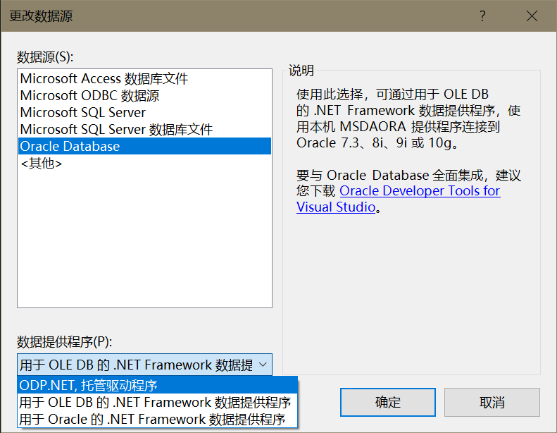
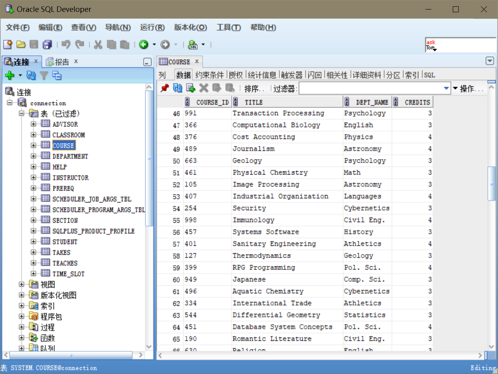
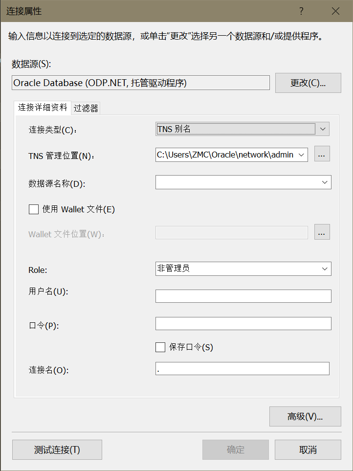
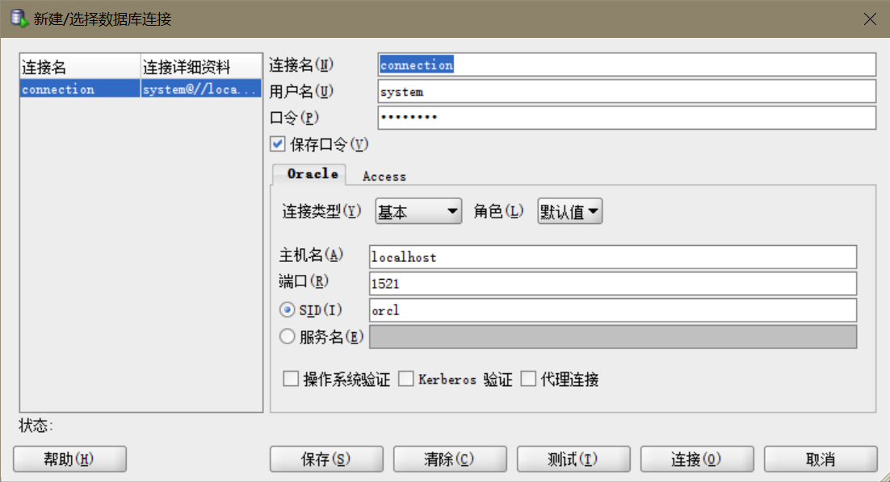
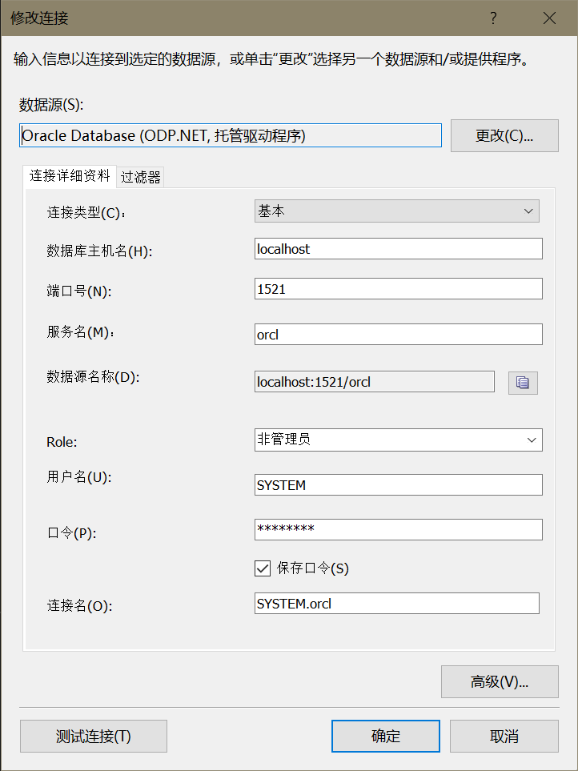
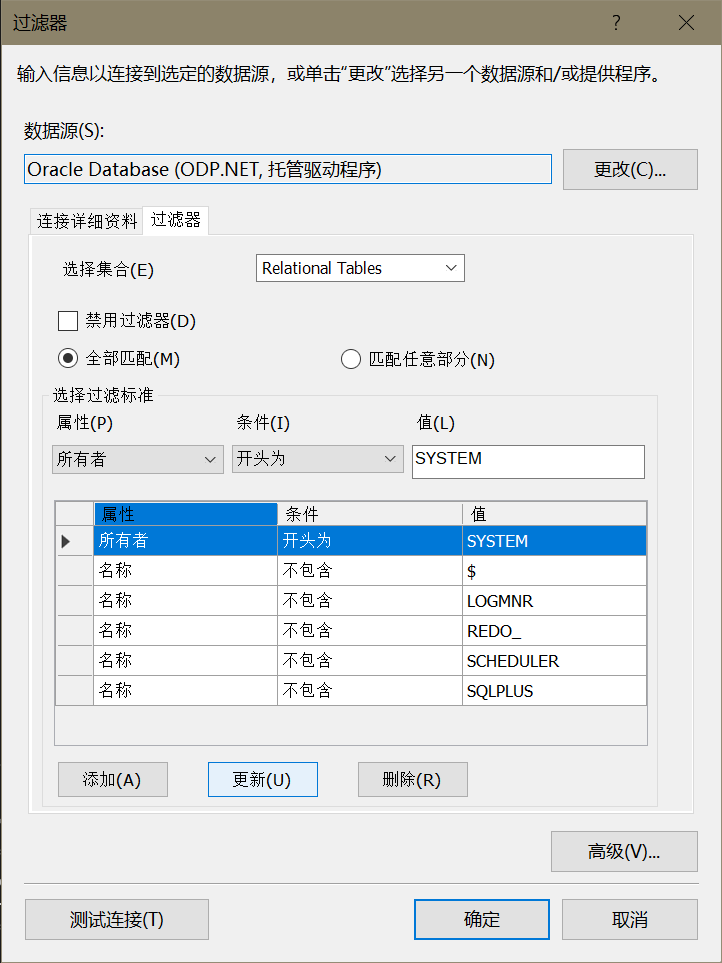
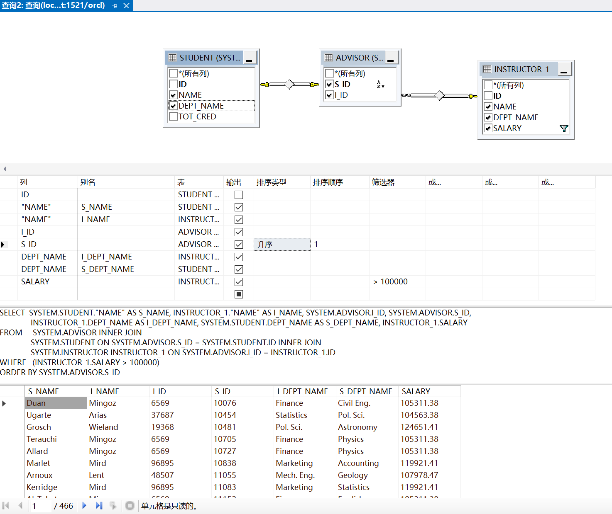

在 VS 连接 Oracle 数据库时，数据提供程序会有以下三个选项：

然而当你选择“用于 OLE DB 的 .NET Framework 数据提供程序”和“用于 Oracle 的 .NET Framework 数据提供程序”来连接 Oracle 数据库时却会提示你这种方式过时了，对 Oracle 的支持只到 10g 版本，所以最好还是选择“ ODP.NET, 托管驱动程序”来进行连接。

下面以新建一个解决方案为例，修改之前的连接同理。

首先是在 Oracle SQL Developer 中已经建好的数据库，导入了教材提供的数据库表和数据（[教材 Web 站点](https://www.db-book.com/)下的"Sample tables"部分），如图（看到的表这么少是因为加了过滤器）：

回到 VS 创建 Oracle 数据库项目、命名、选位置之后到了这个页面：

不知道怎么填就回到 SQL Server，打开你的连接属性，如果照着之前的教程做的话大概是这个样子：

照着填回去就行了

乱七八糟的表更多了，添加几个过滤器看着舒服点

点击表就可以查看内容了

也可以用这个

相当于自动生成查询语句。