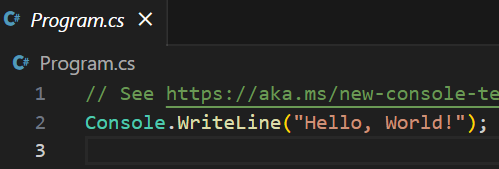
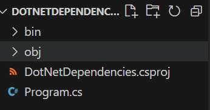
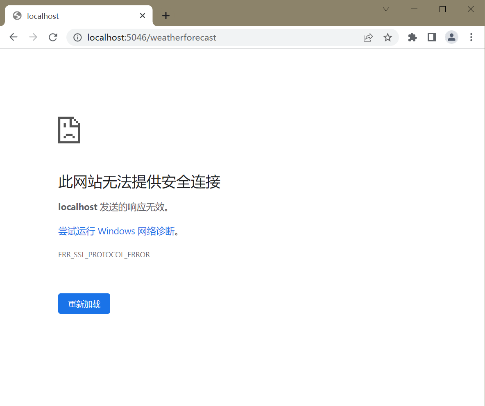
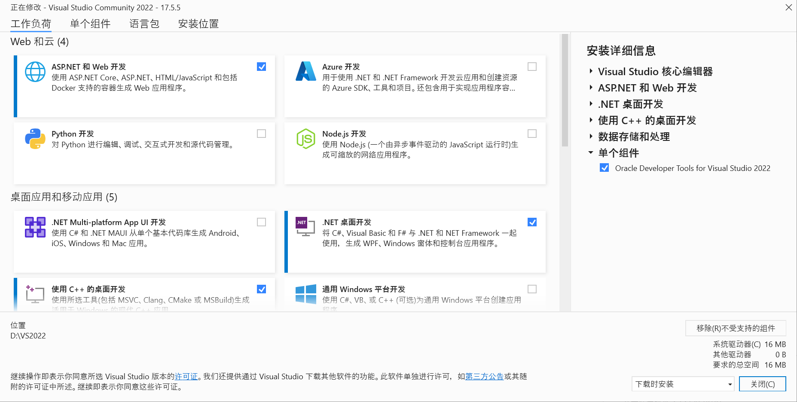
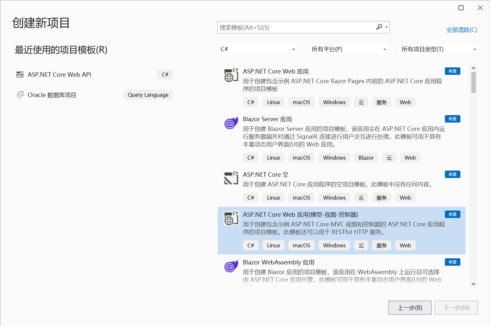
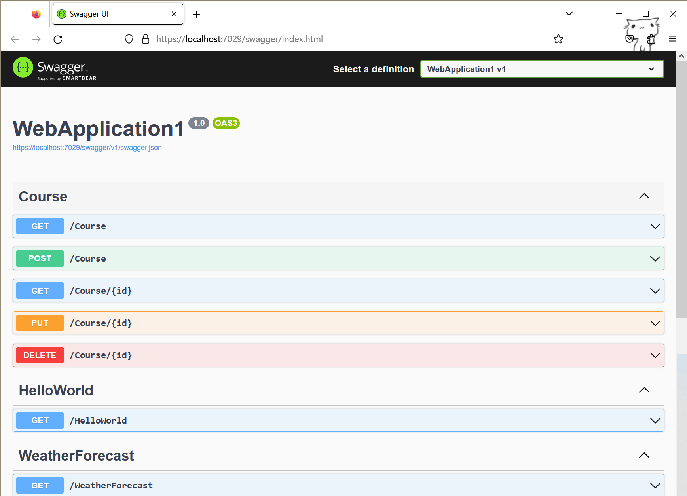
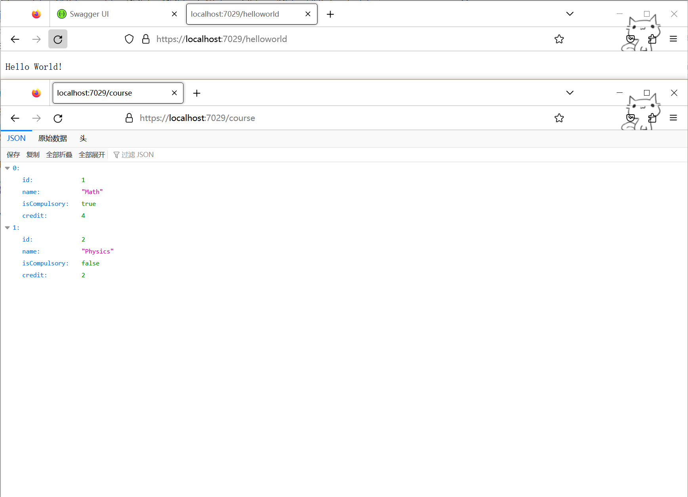

# .NET学习

官方文档：[.NET文档](https://learn.microsoft.com/zh-cn/dotnet/fundamentals/)   [下载.NET](https://dotnet.microsoft.com/zh-cn/download)   [教程文档](https://learn.microsoft.com/zh-cn/training/paths/build-dotnet-applications-csharp/)   [NuGet 文档](https://learn.microsoft.com/zh-cn/nuget/)   [.NET CLI 文档](https://learn.microsoft.com/zh-cn/dotnet/core/tools/)

### 一些概念

字多，不想看的可以跳过。

`API`：Application Programming Interface，应用程序编程接口，简单理解就是给程序员提供的工具，以便轻松完成想要的功能。

`.NET`：由 Microsoft 创建的**跨平台开源**开发人员**平台**，用于生成许多不同类型的应用程序。提供一组标准的**基类库和 API**，可使用**C#、F#、Visual Basic 编程语言**进行编程。

`ASP.NET`：由 Microsoft 创建的开放源代码 Web **框架**，助你使用 .NET 生成现代 Web 应用和服务。                        ASP.NET 为 .NET 平台添加了以下内容:                        

- **用于处理 C# 或 F# 中 Web 请求的基础框架**
- **用于使用 C# 构建动态网页的网页模板化语法**，称为 Razor。
- **通用 Web 模式的库**，例如模型-视图-控制器 (MVC)
- **身份验证系统**包括用于处理登录名的库、数据库、模板页面，包括使用 Google、Twitter 等进行多重身份验证和外部身份验证。
- **编辑器扩展**提供了语法突出显示、代码完成和其他专门用于开发网页的功能

`ASP.NET Core`：ASP.NET 的开源和跨平台版本。

`Web API`：浏览器提供的一套操作**浏览器功能**和**页面元素**的接口。

`HTTP`：超文本传输协议（Hyper Text Transfer Protocol）是一个简单的请求-响应协议，基于 B/S 架构进行通信，它指定了客户端可能发送给服务器什么样的消息以及得到什么样的响应。

`HTTPS`：Hyper Text Transfer Protocol Secure，是以安全为目标的 HTTP 通道，在 HTTP 的基础上通过传输加密和身份认证保证了传输过程的安全性。

`localhost`：本地主机，是给回路网络接口的一个标准主机名，相对应的IP地址为127.0.0.1（IPv4）和[::1]（IPv6）。

## VSCode 创建示例 .NET 项目并使用依赖项

### 创建示例 .NET 项目

这里使用 `.NET7.0 SDK` 和 `Visual Studio Code`（安装 C# 拓展）

运行以下命令确保已经安装.NET7.0：

```
dotnet --list-sdks
```

得到输出：

```
7.0.203 [C:\Program Files\dotnet\sdk]
```

创建名为 `DotNetDependencies` 的新文件夹，在终端窗口中输入以下命令：

```
dotnet new console -f net7.0
```

此命令会在文件夹中创建一个 `Program.cs` 文件（内附已编写的基本“Hello World”程序），还将创建一个名为 `DotNetDependencies.csproj` 的 C# 项目文件。



在终端窗口中，使用以下命令来运行程序：

```
dotnet run
```

### 安装和使用依赖项

要查找已经安装的依赖项，运行以下命令：

```
dotnet list package
```

通过运行以下命令安装 `Humanizer` 库（可以使用 `--version` 安装指定版本）：

```
dotnet add package Humanizer
```

打开 `DotNetDependencies.csproj` 文件可以找到 `ItemGroup` 部分：

```xml
<ItemGroup>
    <PackageReference Include="Humanizer" Version="2.14.1" />
</ItemGroup>
```

重写 `Program.cs` 文件：

```c#
using Humanizer;

static void HumanizeQuantities()
{
    Console.WriteLine("case".ToQuantity(0));
    Console.WriteLine("case".ToQuantity(1));
    Console.WriteLine("case".ToQuantity(5));
}

static void HumanizeDates()
{
    Console.WriteLine(DateTime.UtcNow.AddHours(-24).Humanize());
    Console.WriteLine(DateTime.UtcNow.AddHours(-2).Humanize());
    Console.WriteLine(TimeSpan.FromDays(1).Humanize());
    Console.WriteLine(TimeSpan.FromDays(16).Humanize());
}

Console.WriteLine("Quantities:");
HumanizeQuantities();

Console.WriteLine("\nDate/Time Manipulation:");
HumanizeDates();
```

运行得到如下输出：

```
Quantities:
0 cases
1 case 
5 cases

Date/Time Manipulation:
昨天
2 小时前
1 天
2 周
```

说明依赖项已经正确安装并使用。

### 使用 VSCode 调试

调试控制台不接受正在运行的程序的终端输入，若要在调试时处理终端输入，可以使用集成终端（`Visual Studio Code` 窗口之一）或外部终端。 这里使用集成终端：

打开 `.vscode/launch.json` 并更改 `console` 设置。

从

```json
"console": "internalConsole",
```

到

```json
"console": "integratedTerminal",
```

#### 条件跟踪

除了简单的 `Write` 和 `WriteLine` 方法之外，还可以使用 `WriteIf` 和 `WriteLineIf` 添加条件

```c#
Debug.WriteLineIf(count == 0, "The count is 0 and this may cause an exception.");
```

等同于

```c#
if(count == 0)  
    Debug.WriteLine("The count is 0 and this may cause an exception.");
```

#### 断言`Assert`语句

可以使用位于 `System.Diagnostics` 命名空间中的 `Debug` 或 `Trace` 的 `Assert` 方法。 程序的发行版中不包含 `Debug` 类方法，因此它们不增大发行代码的大小，也不会减慢发行代码的速度。

```c#
// If n2 is 5 continue, else break.
Debug.Assert(n2 == 5, "The return value is not 5 and it should be.");
return n == 0 ? n1 : n2;
```

- 调试时断言失败，调试器将停止应用程序，并将消息输出到调试控制台。
- 运行时会在断言失败后中止，并且已将信息记录到应用程序输出。
- 在 `Release` 配置中运行应用程序：

```
dotnet run --configuration Release
```

由于不再处于 `Debug` 配置中，应用程序成功运行到完成。

## 文件和目录操作

如果对`C#`文件和目录操作足够熟悉，可以跳过此部分。

### 使用 Directory 查看文件系统

`System.IO.Directory`类公开用于创建、移动以及枚举目录和子目录的静态方法。现有目录如下：

```
📂 stores
    📄 sales.json
    📄 totals.txt
    📂 201
       📄 sales.json
       📄 salestotals.json
       📄 inventory.txt
    📂 202
```

#### 列出目录中所有文件

可以使用 `Directory.EnumerateFiles` 函数

```c#
IEnumerable<string> files = Directory.EnumerateFiles("stores");

foreach (var file in files)
{
    Console.WriteLine(file);
}

// Outputs:
// stores/totals.txt
// stores/sales.json
```

#### 列出所有目录

使用 `Directory.EnumerateDirectories` 函数

```c#
IEnumerable<string> listOfDirectories = Directory.EnumerateDirectories("stores");

foreach (var dir in listOfDirectories) {
    Console.WriteLine(dir);
}

// Outputs:
// stores/201
// stores/202
```

#### 搜索模式文件和目录

`Directory.EnumerateDirectories` 和 `Directory.EnumerateFiles` 函数都具有一个重载，接受用于指定搜索模式文件和目录必须匹配的参数。

它们还具有另一个重载，该重载接受用于指示是否以递归方式遍历指定的文件夹及其所有子文件夹的参数。

```c#
// Find all *.txt files in the stores folder and its subfolders
IEnumerable<string> allFilesInAllFolders = Directory.EnumerateFiles("stores", "*.txt", SearchOption.AllDirectories);

foreach (var file in allFilesInAllFolders)
{
    Console.WriteLine(file);
}

// Outputs:
// stores/totals.txt
// stores/201/inventory.txt
```

### 使用 .NET 操作文件路径

#### 目录

##### 确定当前目录

使用`Directory.GetCurrentDirectory` 方法

```c#
Console.WriteLine(Directory.GetCurrentDirectory());
//if in folder "201"
//Output: stores\201 
```

##### 创建目录

使用 `Directory.CreateDirectory` 方法，如果目标文件夹不存在则自动创建（也可以用 `Directory.Exists` 方法确认目录是否存在）

```c#
Directory.CreateDirectory(Path.Combine(Directory.GetCurrentDirectory(), "stores","201","newDir"));
//stores/201 -> stores/201/newDir
```

##### 特殊目录

`.NET` 可在任何位置： `Windows`、`macOS`、`Linux` ，甚至 `iOS` 和 `Android` 上运行。`System.Environment.SpecialFolder` 枚举指定用于检索特殊系统文件夹路径的常量。

以下代码将返回任何操作系统的路径，该路径等效于 `Windows\MyDocuments` 文件夹路径或用户的主目录路径（即使此代码在 `Linux` 上运行也是如此）：

```c#
string docPath = Environment.GetFolderPath(Environment.SpecialFolder.MyDocuments);
```

#### 路径

`.NET` 包含一个 `Path` 类，专用于处理路径，位于 `System.IO` 命名空间中。

##### 生成路径

不同的操作系统使用不同的字符来分隔目录级别。如`Windows` 使用反斜杠 (`stores\201`)，而 `macOS` 使用正斜杠 (`stores/201`)。

`Path` 类包含 `DirectorySeparatorChar` 字段，可帮助你使用正确的字符。

当你需要手动生成路径时，`.NET` 会自动将该字段解释为适用于操作系统的分隔符。

```c#
Console.WriteLine($"stores{Path.DirectorySeparatorChar}201");
// Outputs:
// stores\201 on Windows
// stores/201 on macOS
```

##### 连接路径

使用 `Path.Combine` 函数

```c#
Console.WriteLine(Path.Combine("stores","201")); 
// outputs: stores/201
```

##### 确定文件拓展名

使用 `Path.GetExtension` 函数

```c#
Console.WriteLine(Path.GetExtension("sales.json")); 
// outputs: .json
```

#### 文件

##### 创建文件

使用 `File.WriteAllText` 方法，如果此文件已存在，则会将其覆盖。例如，此代码创建一个名为 `greeting.txt` 的文件，其中包含文本 “Hello World!”：

```c#
File.WriteAllText(Path.Combine(Directory.GetCurrentDirectory(), "greeting.txt"), "Hello World!");
```

##### 读写文件

- 通过 `File` 类上的 `ReadAllText` 方法读取文件，返回一个字符串

```c#
File.ReadAllText($"stores{Path.DirectorySeparatorChar}201{Path.DirectorySeparatorChar}sales.json");
```

- 使用相同的 `WriteAllText` 方法，传入要写入的数据

```c#
var data = JsonConvert.DeserializeObject<SalesTotal>(salesJson);
File.WriteAllText($"salesTotalDir{Path.DirectorySeparatorChar}totals.txt", data.Total.ToString());

// totals.txt
// 22385.32
```

- 可以使用 `File.AppendAllText` 方法追加数据

```c#
var data = JsonConvert.DeserializeObject<SalesTotal>(salesJson);
File.AppendAllText($"salesTotalDir{Path.DirectorySeparatorChar}totals.txt", $"{data.Total}{Environment.NewLine}");

// totals.txt
// 22385.32
// 22385.32
```

#### 其他

- 可以使用 `DirectoryInfo` 或 `FileInfo` 类获取关于目录或文件的最完整信息。
- 还有很多其他文件和目录操作的类和方法，参考`C#`教程

## 使用 ASP.NET Core 控制器创建 Web API

当你浏览网页时，`Web` 服务器将使用 `HTML`、`CSS` 和 `JavaScript` 与浏览器通信。 如果你与页面进行某种交互，例如提交登录窗体或选择购买按钮，浏览器会将信息发送回 `Web` 服务器。

同样的，`API` 客户端通过 `HTTP` 与服务器通信，两者都使用 `JSON` 或 `XML` 等数据格式来交换信息。 `API` 通常供单页应用程序 (`SPA`) 用于在 `Web` 浏览器中执行大部分用户界面逻辑。 与 `Web` 服务器的通信主要是通过 `Web API` 进行的。

### REST：用于使用 HTTP 生成 API 的常见模式

表述性状态转移 (`REST`) 是一种用于生成 `Web` 服务的体系结构样式。 `REST` 请求是通过 `HTTP` 发出的。 它们使用 `Web` 浏览器用于检索网页和将数据发送到服务器的相同 `HTTP` 谓词。 谓词如下：

- `GET`：从 `Web` 服务检索数据。
- `POST`：在 `Web` 服务上创建新的数据项。
- `PUT`：更新 `Web` 服务上的数据项。
- `PATCH`：通过描述有关如何修改项的一组说明，更新 `Web` 服务上的数据项。 本模块中的示例应用程序不使用此谓词。
- `DELETE`：删除 `Web` 服务上的数据项。

遵循 `REST` 的 `Web` 服务 `API` 称为 `RESTful API`。 它们通过以下方法进行定义：

- 一个基 `URI`（统一资源标识符）。
- `HTTP` 方法，如 `GET`、`POST`、`PUT`、`PATCH` 或 `DELETE`。
- 数据的媒体类型，例如 `JSON` 或 `XML`。

### 创建 Web API 项目

#### 基础操作

新建文件夹，在终端中输入：

```
dotnet new webapi -f net7.0
```

此命令使用别名为 *`webapi`* 的 `ASP.NET Core` 项目模板来创建基于 `C#` 的 `Web API` 项目的基架，将创建使用控制器的基本 `Web API` 项目的文件，以及一个 `.csproj` （命名与文件夹相同，我这里命名为`WebAPI`）的 `C#` 项目文件，该文件将返回天气预报列表。 如果遇到错误，请确保已安装 `.NET 7.0 SDK`

> 默认使用 `https` 保护 Web API 项目。 如果遇到问题，请[配置 ASP.NET Core HTTPS 开发证书](https://learn.microsoft.com/zh-cn/aspnet/core/security/enforcing-ssl#trust-the-aspnet-core-https-development-certificate-on-windows-and-macos)。

运行命令：

```
dotnet run
```

> 上述命令：
>
> - 在当前目录中找到项目文件。
> - 检索并安装此项目所需的任何项目依赖项。
> - 编译项目代码。
> - 使用 ASP.NET Core Kestrel Web 服务器将 Web API 托管在 HTTP 和 HTTPS 终结点中。
>
> 创建项目时，将为 HTTP 选择 5000 到 5300 端口，为 HTTPS 选择 7000 到 7300 端口。 通过编辑项目的 launchSettings.json 文件，可以轻松更改开发过程中使用的端口。

你将获得如下输出，指示应用正在运行：

```
正在生成...
info: Microsoft.Hosting.Lifetime[14]
      Now listening on: http://localhost:5046
info: Microsoft.Hosting.Lifetime[0]
      Application started. Press Ctrl+C to shut down.
info: Microsoft.Hosting.Lifetime[0]
      Hosting environment: Development
info: Microsoft.Hosting.Lifetime[0]
      Content root path: D:\repos\WebAPI
```

##### 退出Web API

如果想要退出`Web API`，可以在控制台中按`ctrl+c`

##### 查看

如果你是在自己的计算机上运行此应用，可以将浏览器指向输出中显示的 `HTTPS` 链接（在上例中为 `https://localhost:5046`）以查看生成的页面。 请记住此端口，因为你在使用 `{PORT}` 的模块中将一直使用它。

为了得到天气预报数据，打开 Web 浏览器输入：

```
https://localhost:{PORT}/weatherforecast
```

会得到这个（以 `Chrome` 为例）：



解决的话也很简单，把`https`改成`http`就行了

出现此问题的原因是开发证书不受信任，可以使用 `dotnet dev-certs https --trust`[配置系统以信任开发证书](https://learn.microsoft.com/zh-cn/aspnet/core/security/enforcing-ssl#trust-the-aspnet-core-https-development-certificate-on-windows-and-macos)。（但是我按照他给的方法做了还是打不开，索性后面都用`http`了）

#### .NET HTTP REPL 命令行工具

1. 打开新的终端（`“Terminal”->"New Terminal"`或`ctrl+shift+ˋ`或点击下方`Terminal`右侧的加号）运行：

   ```
   dotnet tool install -g Microsoft.dotnet-httprepl
   ```

   该命令将安装 .NET HTTP REPL 命令行工具，你将使用它向 Web API 发出 HTTP 请求

2. 运行命令连接到Web API：

   ```
   httprepl https://localhost:{PORT}
   ```

   或者在`HttpRepl`运行时输入：

   ```
   connect https://localhost:{PORT}
   ```

3. 若要在`HttpRepl`运行时退出，命令为：

   ```
   exit
   ```

4. 如果遇到`Unable to find an OpenAPI description`警告，最有可能的原因是开发证书不受信任。 `HttpRepl` 需要信任连接。可以将上述命令的`https`改为`http` 。

5. 通过运行以下命令浏览可用的终结点，该命令将检测连接的终结点上所有可用的 API。

   > 终结点是用来发送或接收消息（或同时执行这两种操作）的构造 ，包括一个定义消息可以发送到的目的地位置（地址）、一个描述消息该如何发送的通信机制规范（绑定），以及可以在该位置发送或接收的一组消息的定义（服务协定）

   ```
   ls
   ```

   输出：

   ```
   .                 []    
   WeatherForecast   [GET] 
   ```

6. 运行以下命令以转到 `WeatherForecast` 终结点（与文件操作方式相同，如同样可以使用`../`返回上级目录）：

   ```
   cd WeatherForecast
   ```

7. 在 `HttpRepl` 中发出 `GET` 请求：

   ```
   get
   ```

   输出如下，类似于转到浏览器中的终结点：

   ```
   http://localhost:5046/WeatherForecast> get
   HTTP/1.1 200 OK
   Content-Type: application/json; charset=utf-8
   Date: Thu, 11 May 2023 07:21:51 GMT
   Server: Kestrel
   Transfer-Encoding: chunked
   
   [
     {
       "date": "2023-05-12",
       "temperatureC": -7,
       "temperatureF": 20,
       "summary": "Hot"
     },
     //...
   ]
   ```

#### ASP.NET Core Web API 控制器

在`WeatherForecast.cs`中可以查看示例代码，了解如何用 `ControllerBase` 基类和几个 .NET 属性来生成正常工作的 Web API。 了解这些概念后，便可以编写自己的类了。

##### 基类：`ControllerBase`

控制器是一个公共类，具有一个或多个称为“操作”的公共方法。 按照惯例，控制器放在项目根目录的 Controllers 目录中。示例的`WeatherForecastController`类继承自 `ControllerBase` 基类。

操作通过路由被公开为 HTTP 终结点。 因此，对 `http://localhost:{PORT}/weatherforecast` 的 HTTP `GET` 请求将执行 `WeatherForecastController` 类的 `Get()` 方法。

##### API 控制器类属性

```c#
[ApiController]
[Route("[controller]")]
public class WeatherForecastController : ControllerBase
```

- `[ApiController]` 启用[固定行为](https://learn.microsoft.com/zh-cn/aspnet/core/web-api/#apicontroller-attribute-1)，使生成 Web API 更加容易。此属性包括多个特定于 API 的固定行为，例如自动处理错误的 HTTP 请求。
- `[Route]` 定义路由模式 `[controller]`。 `[controller]` 令牌将替换为控制器的名称（不区分大小写，无 Controller 后缀）。 此控制器处理对 `http://localhost:{PORT}/weatherforecast` 的请求。

### 添加一个简单的 Hello World 控制器

在`Controllers`文件夹中新建一个`HelloWorld.cs`文件。目录名称 `Controllers` 是一种约定。 目录名称来自 Web API 使用的模型-视图-控制器体系结构。

写入如下内容，包括一个派生自`ControllerBase`的类、前文提到的两个标准属性`[ApiController]`和`[Route("[controller]")]`，以及一个`GET`谓词。

```c#
using Microsoft.AspNetCore.Mvc;

namespace HelloWorld.Controllers;
[ApiController]
[Route("[controller]")]

public class HelloWorldController : ControllerBase
{
    public HelloWorldController(){}

    [HttpGet]
    public ActionResult<string> Get()
    {
        return "Hello World!";
    }
}
```

按之前的方法启动 Web API 并连接后，可以在`HttpRepl`中发送`GET`请求，返回如下：

```
http://localhost:5046/HelloWorld> get
HTTP/1.1 200 OK
Content-Type: text/plain; charset=utf-8
Date: Thu, 11 May 2023 08:30:35 GMT
Server: Kestrel
Transfer-Encoding: chunked

Hello World!


```

如果使用浏览器（此处以`Firefox`为例）打开，可以看到：


### 添加数据存储

#### 创建模型（类）

假设要为选课系统开发一个`RESTful`服务，作为 Web 和移动应用程序的必备组件。在为选课实现 Web API 之前，需要添加一个数据存储供操作。

创建 `Models` 文件夹用于存储模型（手动或用`mkdir Models`命令）。目录名称 `Models` 是一种约定，来自 Web API 使用的模型-视图-控制器体系结构。

在其中添加一个`Course.cs`文件并添加代码，以定义课程类`Course`。

```c#
namespace WebAPI.Models;

public class Course
{
    public int Id { get; set; }
    public string? Name { get; set; }
    public bool IsCompulsory { get; set; }
    public int Credit { get; set; }
}
```

#### 添加数据服务

创建`Services`文件夹，在其中添加`CourseService.cs`文件，随后添加代码用于创建服务。

```c#
using WebAPI.Models;

namespace WebAPI.Services;

public static class CourseService
{
    static List<Course> Courses { get; }
    static int nextId = 3;
    static CourseService()
    {
        Courses = new List<Course>{
            new Course { Id = 1, Name = "Math", IsCompulsory = true, Credit = 4},
            new Course { Id = 2, Name = "Physics", IsCompulsory = false, Credit = 2},
        };
    }

    public static List<Course> GetAll() => Courses;

    public static Course? Get(int id) => Courses.FirstOrDefault(p => p.Id == id);

    public static void Add(Course course){
        course.Id = nextId++;
        Courses.Add(course);
    }

    public static void Delete(int id){
        var course = Get(id);
        if(course is null)  return;
        Courses.Remove(course);
    }

    public static void Update(Course course){
        var index = Courses.FindIndex(p => p.Id == course.Id);
        if(index == -1) return;
        Courses[index] = course;
    }
}
```

默认情况下，此服务提供一个简单的内存中数据缓存服务，默认构造两个课程。此外还有增删改查的服务。

该数据存储是一个简单的本地内存中缓存服务。 在实际应用程序中，可以考虑将数据库（例如 SQL Server）与 Entity Framework Core 结合使用。

#### 生成 Web API 项目

运行命令

```
dotnet build
```

### CRUD操作

HTTP 谓词的标准化使用方式，也称为创建、读取、更新、删除 (CRUD)。

先用与上文生成`HelloWorld`控制器类似的方式生成一个`CourseController`控制器，位于`Controllers\CourseController.cs`中。

```c#
using WebAPI.Models;
using WebAPI.Services;
using Microsoft.AspNetCore.Mvc;

namespace WebAPI.Controllers;
[ApiController]
[Route("[controller]")]

public class CourseController : ControllerBase
{
    public CourseController() {}

    [HttpGet]
    public ActionResult<List<Course>> GetAll() =>
        CourseService.GetAll();

    [HttpGet("{id}")]
    public ActionResult<Course> Get(int id)
    {
        var course = CourseService.Get(id);
        if(course == null)  return NotFound();
        return course;
    }

    // POST action

    // PUT action

    // DELETE action

}
```

#### 读取`GET`

- `[HttpGet]` 属性表示仅响应 HTTP `GET` 谓词。路由逻辑将 `[HttpGet]`（没有 `id`）和 `[HttpGet("{id}")]`（具有 `id`）注册为两个不同的路由，分别为返回所有和按`id`查找。
- 返回类型为 `ActionResult` 实例。 `ActionResult` 类型是 ASP.NET Core 中所有操作结果的基类。
- 要求 `course/` 之后的 URL 段中包含 `id` 参数的值。控制器级别的 `[Route]`属性定义了`/course`模式。
- `ActionResult` 实例映射到下表中对应的 HTTP 状态代码：

| ASP.NET Core 操作结果 | HTTP 状态代码 | 说明                                                         |
| :-------------------- | :------------ | :----------------------------------------------------------- |
| `Ok` 为隐式           | 200           | 内存中缓存中存在与所提供的 `id` 参数匹配的产品。 该产品包含在由 `accept` HTTP 请求标头中所定义的媒体类型（默认情况下为 JSON）的响应正文中。 |
| `NotFound`            | 404           | 内存中缓存中不存在与所提供的 `id` 参数匹配的产品。           |

#### 创建`POST`

将`// POST action`部分替换为以下代码：

```c#
[HttpPost]
public IActionResult Create(Course course)
{
    CourseService.Add(course);
    return CreatedAtAction(nameof(Get), new {id = course.Id}, course);
}
```

- 仅响应 HTTP `POST` 谓词

- `CreatedAtAction` 方法调用中的第一个参数表示操作名称。 `nameof` 关键字用于避免对操作名称进行硬编码。 `CreatedAtAction` 使用操作名称来生成 `location` HTTP 响应标头，该标头包含新创建的 URL，如上一个单元中介绍。

- 由于控制器使用 `[ApiController]` 属性进行批注，因此意味着将在请求正文中找到 `Course` 参数。

- `IActionResult` 可让客户端知道请求是否成功，并提供新创建的 ID。 `IActionResult` 通过使用标准 HTTP 状态代码来完成该操作，因此，无论客户端使用哪种语言或者在哪个平台上运行，它都能轻松地与客户端集成。

| ASP.NET Core 操作结果 | HTTP 状态代码 | 说明                                                         |
| :-------------------- | :------------ | :----------------------------------------------------------- |
| `CreatedAtAction`     | 201           | 已添加到内存中缓存。 包含在由 `accept` HTTP 请求标头中所定义的媒体类型（默认情况下为 JSON）的响应正文中。 |
| `BadRequest` 为隐式   | 400           | 请求正文的 `course` 对象无效。                               |

#### 更新`PUT`

将`// PUT action`部分替换为以下代码：

```c#
[HttpPut("{id}")]
public IActionResult Update(int id, Course course)
{
if (id != course.Id)  return BadRequest();
var existingCourse = CourseService.Get(id);
if (existingCourse is null) return NotFound();
CourseService.Update(course);
return NoContent();
}
```

- 仅响应 HTTP `PUT` 谓词.
- 要求 `course/` 之后的 URL 段中包含 `id` 参数的值。
- 返回 `IActionResult`，因为在运行时之前，`ActionResult` 返回类型未知。 `BadRequest`、`NotFound` 和 `NoContent` 方法分别返回 `BadRequestResult`、`NotFoundResult` 和 `NoContentResult` 类型。

| ASP.NET Core 操作结果 | HTTP 状态代码 | 说明                                       |
| :-------------------- | :------------ | :----------------------------------------- |
| `NoContent`           | 204           | 已在内存中缓存中更新。                     |
| `BadRequest`          | 400           | 请求正文的 `Id` 值与路由的 `id` 值不匹配。 |
| `BadRequest` 为隐式   | 400           | 请求正文的 `Course` 对象无效。             |

#### 删除`DELETE`

将`// DELETE action`部分替换为以下代码：

```c#
[HttpDelete("{id}")]
public IActionResult Delete(int id)
{
    var course = CourseService.Get(id);
    if (course is null) return NotFound();
    CourseService.Delete(id);
    return NoContent();
}
```

- 仅响应 HTTP `DELETE` 谓词.
- 要求 `course/` 之后的 URL 段中包含 `id` 参数的值。

| ASP.NET Core 操作结果 | HTTP 状态代码 | 说明                                         |
| :-------------------- | :------------ | :------------------------------------------- |
| `NoContent`           | 204           | 已从内存中缓存中删除。                       |
| `NotFound`            | 404           | 内存中缓存中不存在与所提供的 `id` 参数匹配。 |

#### 生成并运行

保存更改后，按照之前的方式生成、启动、连接 Web API，逐条运行以下命令验证所做的更改：

```
cd Course
ls
post -c "{"name":"DataBase","isCompulsory":true,"credit":4}"
put 3 -c "{"id":3, "name":"OOP","isCompulsory":true,"credit":2}"
get 3
delete 3
get
```

## 使用 VS 

使用 VS 进行上述步骤很简单，安装 “ASP.NET 和 Web 开发” 和 “.NET 桌面开发”



在新建项目时选择需要的即可



其他部分与在 VSCode 操作差别不大，VS 上运行后会帮你解决`https`的问题，且会显示`Swagger UI`页面：



访问 `https://localhost:7029/helloworld`和`https://localhost:7029/course`，也能得到预期的结果：


