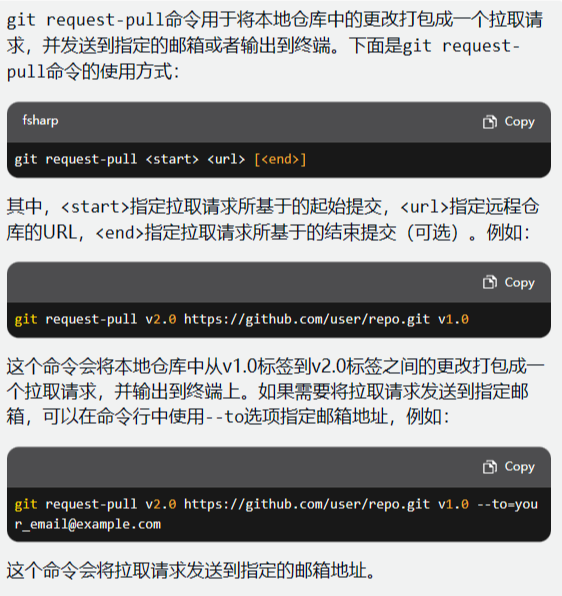

> 本文档更新一下多人协作开发的fork操作需要注意的问题


> 根据之前的文档步骤：创建了一个fork仓库后，你会在你本地目录中修改更新，然后将更新push到自己的fork仓库中，最后再
>
> 在fork仓库中创建pull request!
>
> > ***那么现在产生了一个问题***，你push操作的对象是你fork后的仓库, 这时在本地目录中建立的remote是fork仓库的地址，当你需要再次更改，并且别人已经在原始的仓库中做出了修改，你需要先使用git pull命令将本地的fork仓库更新，但此时remote连接不是原始仓库，你需要在本地fork目录的git bash中先修改remote连接，再拉取更新：
>
> 
>
> 下面介绍几个方法：
>
> - 1、使用git 命令更新：
>
> > 具体的命令：
> >
> > `git remote set-url origin 原始仓库的url`
> >
> > ***注释：上一句将fork仓库连接到原始仓库，这时请使用  git pull 命令更新仓库***
> >
> > ***更新完后，你在自己的fork仓库的本地目录中作出修改，现在需要将更新提交到fork仓库后再做出pull requet，但是现在的remote连接着原始仓库***
> >
> > 现在使用：
> >
> > `git remote set-url origin 你fork仓库的url`
> >
> > ***这样你的remote连接重新连上fork仓库， 使用 git push等命令将更新提交后发出pull request!***
>
> 
>
> > - 2、使用 Git 命令行进行更新：
> >
> >   首先，在你的本地副本中，在命令行中使用 `git remote` 命令检查是否已经将原始仓库的 URL 添加为远程仓库：
> >
> >   ```
> >   git remote -v
> >   ```
> >
> >   如果你还没有添加原始仓库的 URL，可以使用以下命令添加：
> >
> >   ```
> >   git remote add upstream <原始仓库的 URL>
> >   ```
> >
> >   接下来，使用以下命令将原始仓库的更改合并到你的本地副本中：
> >
> >   ```
> >   git fetch upstream
> >   git merge upstream/main
> >   ```
> >
> >   这将从原始仓库中获取最新的更改并将其合并到你的本地副本中。最后，使用以下命令将这些更改推送到你的远程副本中：
> >
> >   ```
> >   git push origin main
> >   ```
> >
> >   
> >
> >   - 3、使用 GitHub 网站进行更新：
> >
> >   首先，在你的 fork 仓库页面上，点击 "Fetch upstream" 按钮，将原始仓库的更改拉取到你的 fork 仓库中。
> >
> >   然后，点击 "New pull request" 按钮，创建一个新的拉取请求。在 "base repository" 下拉菜单中选择原始仓库，将 "head repository" 设置为你的 fork 仓库。点击 "Create pull request"，GitHub 将会显示一个比较原始仓库和你的 fork 仓库之间的差异。
> >
> >   如果你想要将原始仓库的更改合并到你的 fork 仓库中，请点击 "Merge pull request" 按钮。这将把原始仓库的更改合并到你的 fork 仓库中。


附录：下面是我找的其他的发出pull request的方法，暂未试验过, 可以尝试一下：

