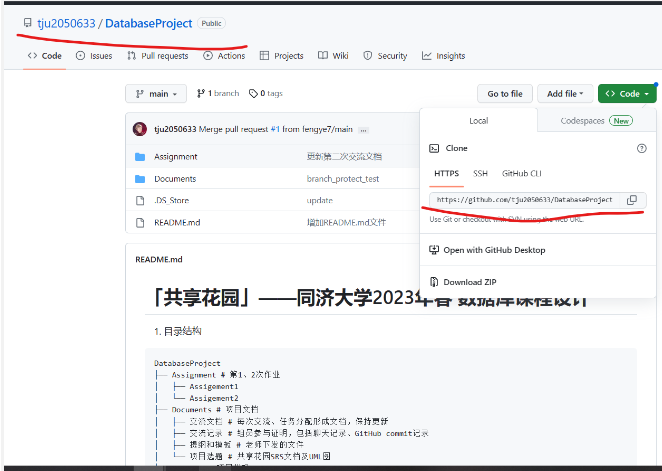
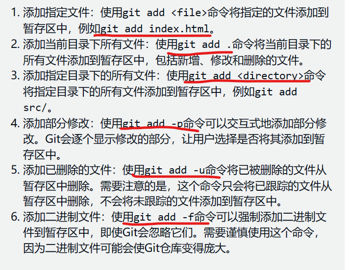
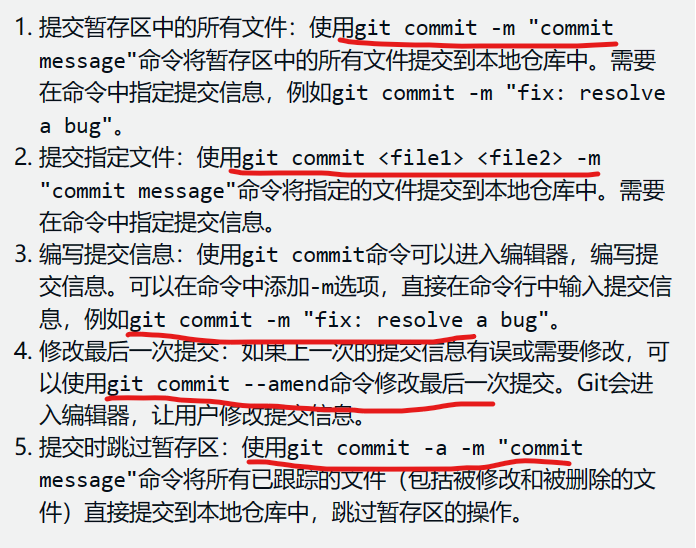
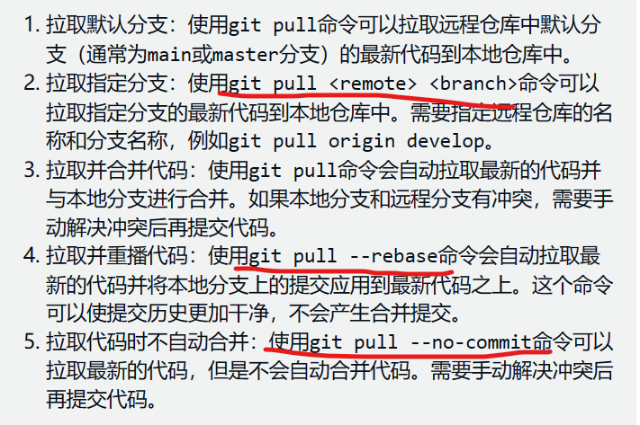
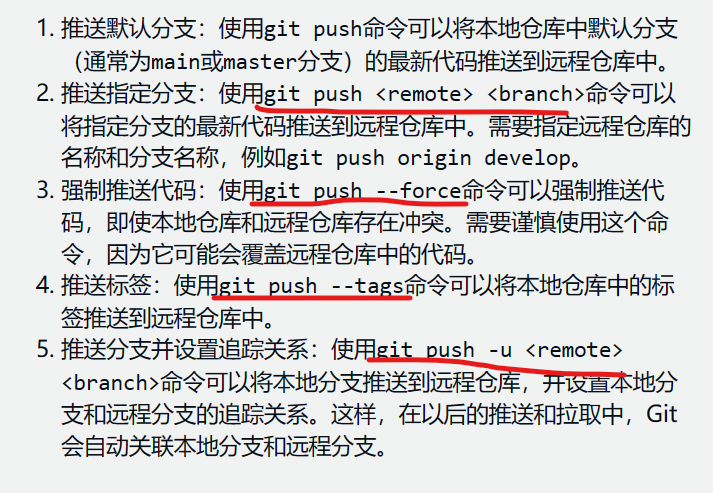
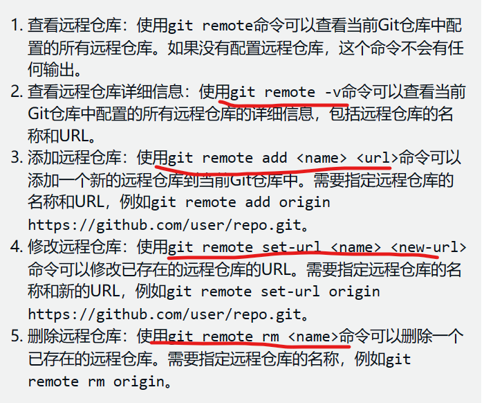

>本文档包括简单的git bash操作
1.  若没有git bash
 >>[Git 详细安装教程（详解 Git 安装过程的每一个步骤）_git安装_mukes的博客-CSDN博客](https://blog.csdn.net/mukes/article/details/115693833)

2.  常规的上传步骤
>进入到本地目录git bash，下面是我们一般的上传步骤：
>>git add **.**
>>git commit -m "你的更新信息的标签"
>>（第一次可能需要远程连接：
>>git remote add origin ***url(你链接的github项目地址)***
>>你可以使用 git remote -v检验远程链接）
>>git push -u origin main

3. 一些git指令的使用方法
>git clone:
>在你选中的本地目录中鼠标右键创建git bash窗口,使用git clone url(在下面)
>
>这样你就将项目克隆到本地了

>git add:
>1. git add **.**         	(该命令将所有未跟踪（untracked）和已修改（modified）的文件添加到Git的暂存区（staging area）中，准备提交到本地仓库。) 一般用这个就够了
>
>2. 其他的一些add操作：
>

>git commit:
>1. git commit -m "你提交的更新信息标签"
>
>2. 其他的git commit操作：
>

>git pull:
>1. 一般使用 git pull 即可
>
>2. 其他的pull操作：
>

>git push:
>1. 一般使用：git push -u origin main
>
>2. 其他操作：
>

>git remote的基本操作：
>
