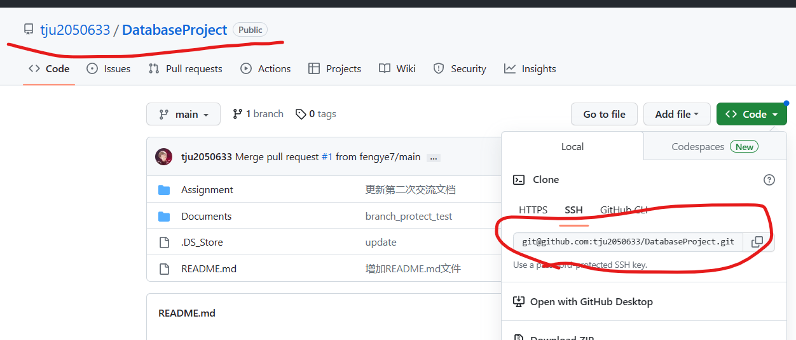
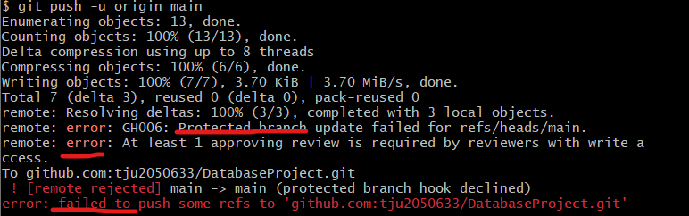
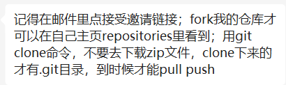
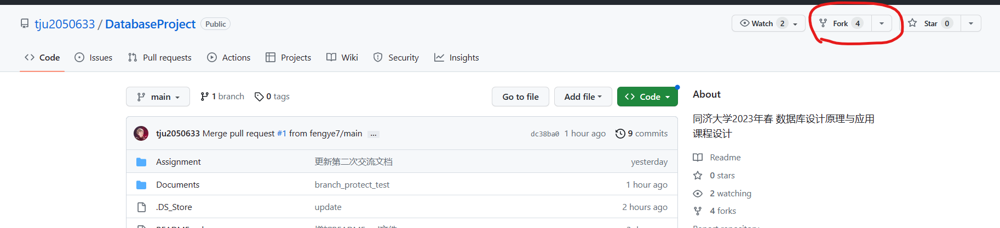
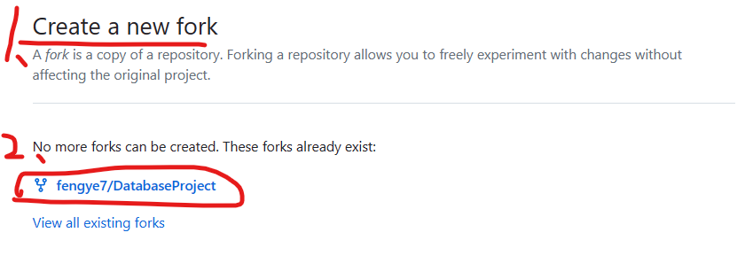
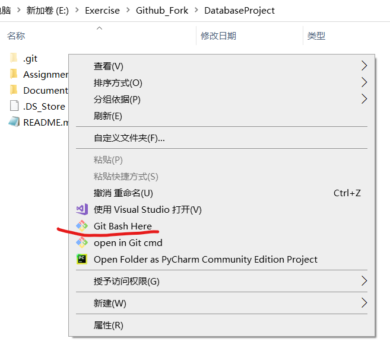
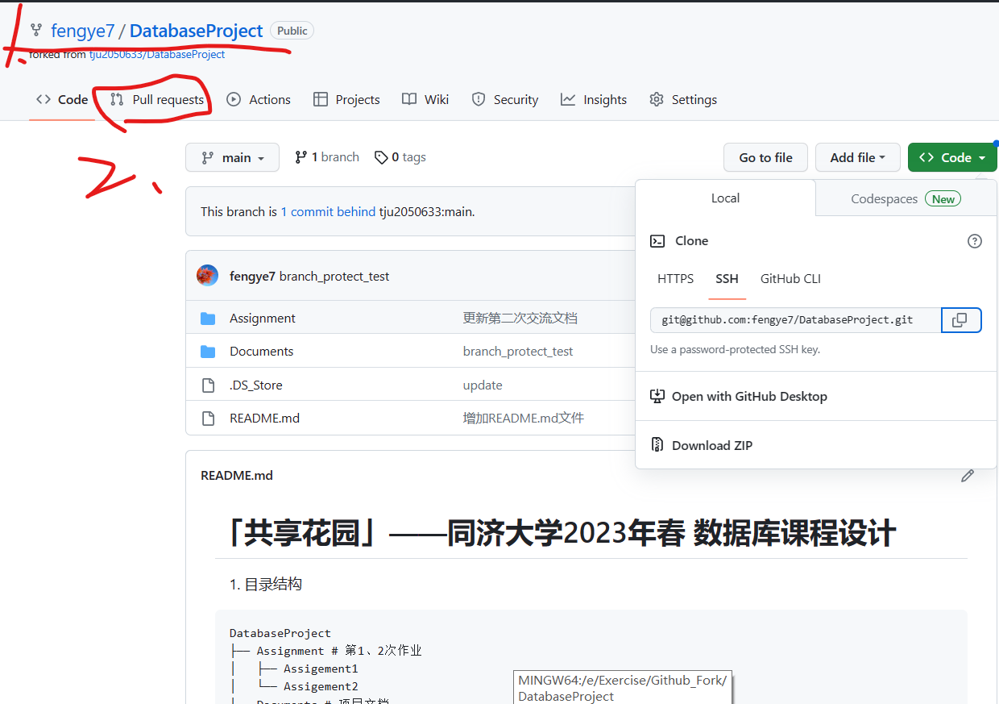
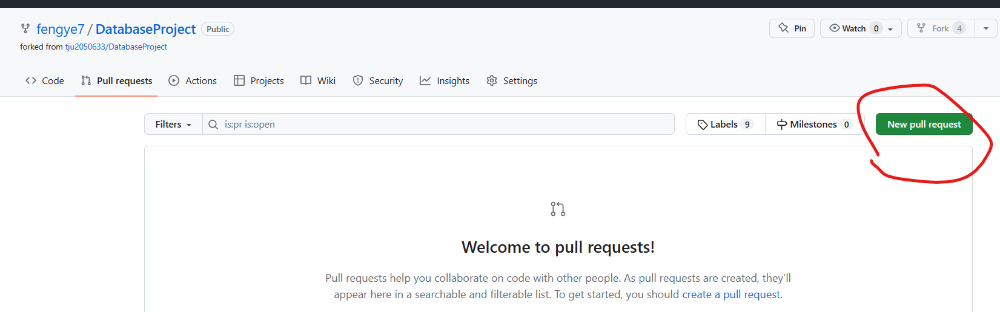
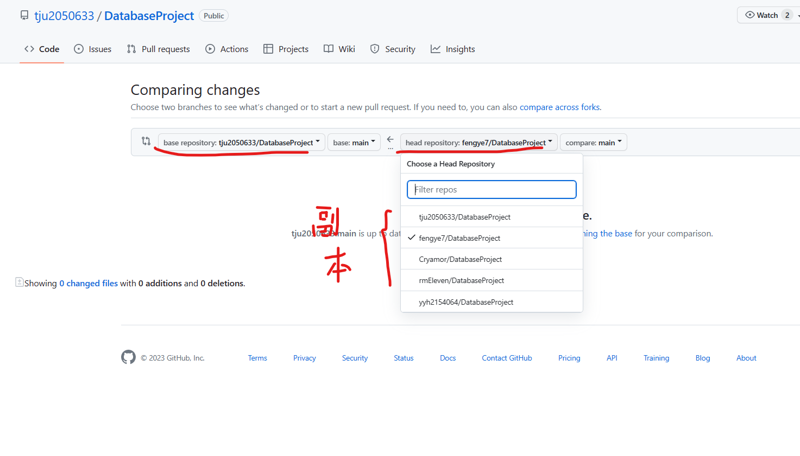


>本文针对数据库课程设计多人开发中存在的项目安全问题，介绍如何在修改文件后远程提交修改时向项目管理者提交申请。

1. 更改项目可能会遇到的问题
>为防止某次提交导致的项目混乱，项目添加了——分支保护(Branch Protection)
如果通过如下方式进行项目的更改提交：
可能会遇到如下问题：在你的目录里使用git bash使用git clone上方的链接得到的本地目录中修改后再push更改会报如下错误：

2. 下面给出正确的操作：
>1、来到根项目：[tju2050633/DatabaseProject: 同济大学2023年春 数据库设计原理与应用 课程设计 (github.com)](https://github.com/tju2050633/DatabaseProject)
>2. 首先确保你已经：

若没有，在如下方点击fork：

>3. 再create a new fork， 这将创建一个项目副本，下方2处便是我创建的副本

>4. 创建好副本后，进入你自己的副本，再按照 git clone 的步骤将该副本下载到本地目录。在你的副本的本地目录完成修改后，在该目录中git bash进入命令行：
>
>>按照正常的更新命令：
>>git add .
>>git commit -m "你自己的更新信息标签"
>>git push -u origin main
>>更新你本地的更改到github中的项目副本中

>5. 最后：来到你自己的fork副本中，以fengye7为例：
>>1处应该是（你的username/项目名）
>点击2处进入到更改请求的申请
>
>
>>现在进入到更改申请：依次 :
>>"New pull requests"
>>"选择需要比较的分支branch"(我这里是没有更改，无法继续操作)
>>"Create a new pull"
>>***注：你在提交申请的时候可以添加更新信息，方便项目管理者快速找到更新处并作出审核。***
>
>
>
>选择比较的分支，当分支有不同的时候，右下角会有一个create a new pull request
>点击创建申请并在这里提供你的更新信息
>
	
	
